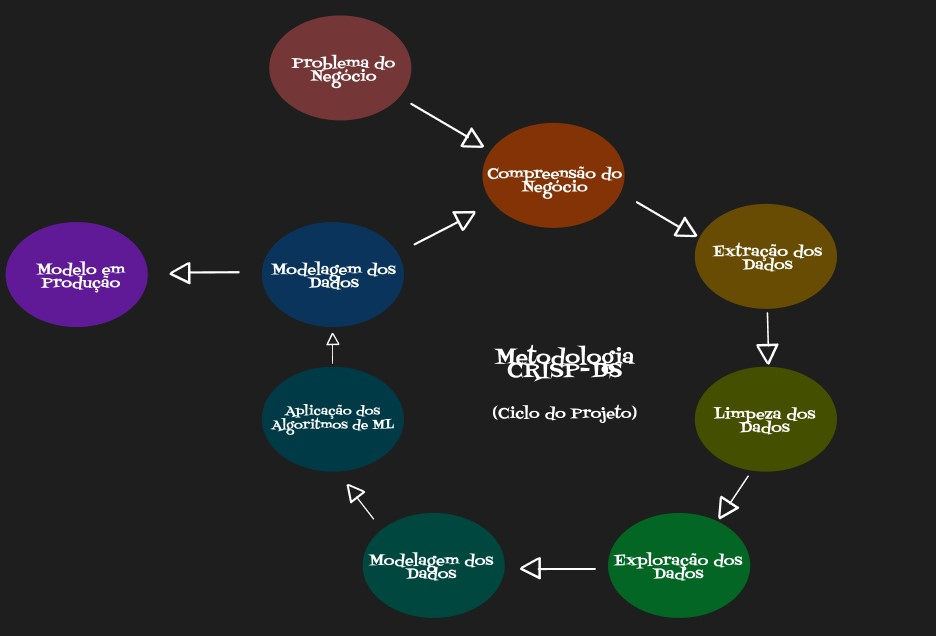

<h1 align='center'>ALL MART PROJECT</h1>

## Contexto do Negócio

> *Disclaimer: O contexto a seguir é completamente fictício. A empresa, o contexto, o CEO, as perguntas de negócio foram idealizadas para simular um problema real de negócio.*

***

A empresa All Mart é uma empresa Outlet Multimarcas, ou seja, ela comercializa produtos de segunda linha de várias marcas a um preço menor, através de um e-commerce.

Em pouco mais de 1 ano de operação, o time de marketing percebeu que alguns clientes da sua base compram produtos mais caro, com alta frequência e acabam contribuindo com uma parcela significativa do faturamento da empresa.

Baseado nessa percepção, o time de marketing vai lançar um programa de fidelidade para os melhores clientes da base, chamado _insiders_. Mas o time não tem um conhecimento avançado em análise de dados para eleger os participantes do programa.

Por esse motivo, o time de marketing requisitou aao time de dados uma seleção de clientes elegíveis ao programa, usando técnicas avançadas de manipulação de dados.

***

## Desafio do Negócio

Você faz parte do time de cientistas de dados da empresa All Mart, que precisa determinar quem são os clientes elegíveis para participar do programa _insiders_. Em posse dessta lista, o time de marketing fará uma sequência de ações personalizadas e exclusivas ao grupo, de modo a aumentar o faturamento e a frequência de compra. 

Como resultado para esse projeto, é esperado que você entregue uma lista de pesaos elegíveis a participar do programa _insiders_, junto com um relatório respondendo às seguintes perguntas:

1. Quem são as pessoas elegíveis para participar do programa _insiders_?
2. Quantos clientes farõa parte do grupo?
3. Quais as principais características desses clientes?
4. Qual a porcentagem de contribuição do faturamento, vinda do programa?
5. Qual a expectativa de faturamento (LTV) desse grupo para os próximos meses?
6. Quais as condições para uma pessoa ser elegível aos _insiders_?
7. Quais as condiçlões para um apessoa ser removida dos _insiders_?

## Dados

O conjunto de dados está disponível na plataforma Kaggle, através do link: https://www.kaggle.com/vik2012kvs/high-value-customers-identification

Cada linha representa uma transição de venda, que ocorreu entre o período de novembro de 2016 e dezembro de 2017.

O conjunto de dados inclui as seguintes informações:

* Invoice Number: identificador único de cada transação.
* Stock Code Product: código do item.
* Description Product: nome do item.
* Quantity: quantidade de cada item comprado por transação.
* Invoice Date: dia em que ocorreu a transação.
* Unit Price: preço do produto por unidade.
* Customer ID: identificador único do cliente.
* Country: país em que o cliente reside.

## Proposta de Solução 

Como parte da solução do projeto, propusemos o uso da metodologia cíclica conhecida por CRISP-DS (Cross-Industry Standard Process for Data Science). Este processo baseia-se em uma separação lógica e clara dos passos para desenvolvimento da solução e em sua estrutura cíclica, de forma que um ciclo consiste em percorrer todas as fases do desenvolvimento e a entrega ágil de uma solução (Minimum Viable Product). Sua natureza cíclica permite não só o refatoramento do código como também a formulação de outras hipóteses, criação de novas features, melhora dos modelos, fine tuning, etc.

Também desenhamos uma estratégia baseada na metodologia IOT (Input, Output & Tasks) como parte da solução do projeto, funcionando basicamente como um _ Sprint Backlog_ do projeto, linkando diretamente as perguntas realizadas na elaboração do problema do negócio.

## Modelo RFM - RFM Análise

1. Champions
    a. Compras recentes, frequentes com alto valor gasto.
    b. Prêmios para esses clientes.

2. Potential Loyalists
    a. Compras recentes, boa frequência e bom valor gasto.
    b. Programa de Fidelização e Upssell

3. New Customers
    a. Compra recente, baixa frequência
    b. Construção de Relacionamento e ofertas especiais.

4. At Risk Customer
    a. "Faz tempo que não compra"
    b. Campnhas de reativação, ofertas, produtos

5. Can't Lose Them
    a. 